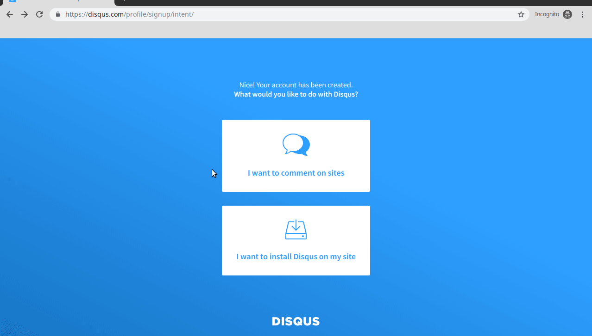
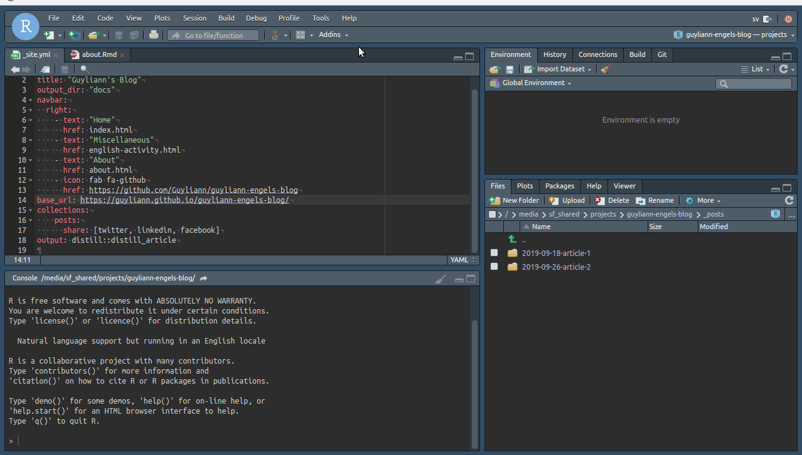

```{r setup, include=FALSE}
knitr::opts_chunk$set(comment = "#", fig.align = "center")
```

##### Objectifs {-}

- créer un blog scientifique en utilisant R Markdown

##### Prérequis {-}

Si ce n’est déjà fait, vous devez installer et vous familiariser avec la ‘SciViews Box’, RStudio, Markdown. Vous devez aussi maîtriser les bases de Git et de GitHub (avoir un compte GitHub, savoir cloner un dépôt localement, travailler avec GitHub Desktop pour faire ses “commits”, “push” et “pull”). L’ensemble de ces outils ont été abordé dans le [module 1](http://biodatascience-course.sciviews.org/sdd-umons/intro.html) de l'[ouvrage interactif Science des données biologiques](http://biodatascience-course.sciviews.org/sdd-umons/). 

# Introduction 

Un fichier [R Markdown](https://rmarkdown.rstudio.com/index.html) est un fichier avec une extension `.Rmd.`. Les documents R Markdown peuvent générer des multitudes de formats de sorties (html, pdf, doxcx, odt,...). Il est possible de réaliser des documents, des présentations, des sites web, des dashboards,... Dans le cadre de ce document, nous vous proposons de réaliser un blog scientifique avec le package distill de RStudio. Afin de vous simplifer cette tâche un [template](http://biodatascience-course.sciviews.org/blog-template/) est mis à votre disposition.

# Procédure

Il faut tout débuter par initialiser votre blog :

- Dans la Sciviews Box, ouvrez Chromium et entrez l'url suivant : <https://github.com/BioDataScience-Course/blog-template>

- Cliquez sur `Use this template` et renseignez le nom du dépôt de votre blog (`Repository name`). Respectez la convention **prenom-nom-blog**.  

- Sélectionnez `Create repository from template`.

```{block, type = 'warning'}
 Si votre nom ou prénom comprend des accents, ne les renseignez pas. Les accents sont une source d'erreur non négligeable en informatique.
```

- Copier l'url afin de copier en local votre dépôt


- Cloner le dépot depuis RStudio


- Localisez votre dépôt de préférence dans le dossier project (`~/shared/projects` )

- Créez votre projet.


- Editez le fichier de paramètre du blog : `_site.yml`
    + titre de blog ->  `title:` 
    + l'url de l'icone GitHub par https://github.com/NOM-UTILISATEUR/PRENOM-NOM-blog `href:`
    + l'url de votre blog par https://NOM-UTILISATEUR.github.io/PRENOM-NOM-blog/  `base_url:`

- Construisez votre site avec l'instruction `Build Website`


- Réalisez un `Commit` avec l'ensemble de vos fichiers

- Réalisez un `Push` 

- Dans GitHub, Vérifiez que vos `commit` est bien présent sur votre dépot en ligne

- Dans la section Settings, Changez la source de la GitHub Pages de `None` par `master branch/docs folder` 

 

- Cliquez sur le lien généré et visualisez votre blog scientifique

 

# Editer votre blog

## Les fichiers généraux

Les différents fichiers au format R Markdown (.Rmd) sont éditable. Il vous suffit ensuite de construire votre site avec l'instruction `Build Website`, de réaliser un `Commit` et un `Push` 

Commencez par éditer le fichier about.Rmd. Ce fichier doit comprendre une petite présentation sur vous (nom, Prenom, nom de votre professeur d'anglais, votre classe, votre groupe, votre année académique,...) et le sujet que vous avez choisi pour ce blog.

## Un article

Pour débuter un nouvelle article sur votre blog, entrez l'instruction suivante dans la console r

```{r, eval = FALSE, echo = TRUE}
distill::create_post("nom-de-votre-article")
```

Dans le dossier _posts vous avez à votre disposition un exemple créé avec l'instruction suivante :

```{r, eval = FALSE, echo = TRUE}
distill::create_post("article-1")
```

Comme vous pouvez le voir, un dossier avec la date a été automatiquement créé. Ce premier article regorge d'idée de personalisation de vos articles.

Il existe de nombreuses astuces sur le site <https://rstudio.github.io/distill/blog.html>

# Ajouter Disqus 

Disqus est un service web qui permet de gérer des discussion sur des blogs. Pour ajouter disqus, vous devez suivre les instructions ci-dessous :

- Ouvrez Chromium et entrez l'url suivant : <https://disqus.com> 

- Cliquez sur `Get Started` et créez vous un comptez sur disqus 

 

- Cliquez ensuite sur `I want to install Disqus on my site`

- Ajoutez le nom de votre website

 

- Dans les configuration de disqus, entrez l'adresse de votre blog

 

- Copiez le shortname de votre site qui se trouve dans la section `Edit Settings`.

 


- Dans le fichier _site.yml de votre projet ajoutez votre `shortname` comme présenté dans l'image suivante.

 

- Terminez par construire votre site, un `Commit` et un `Push`

 
